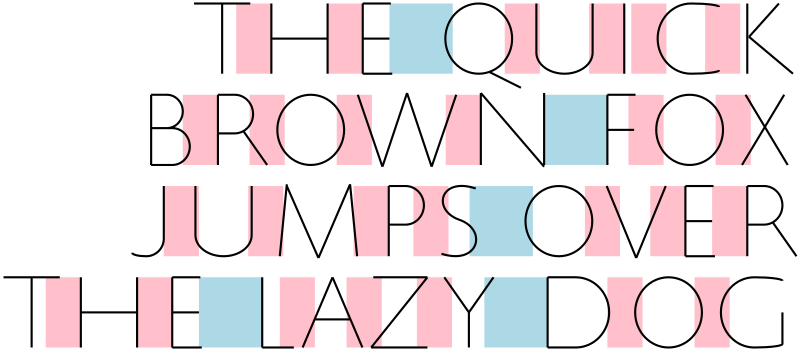
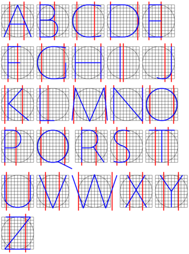

# trajans

Generate skeletons for text set in Trajan capitals

## Rendering text

To render text, use

```
cabal run trajans -- \
  -o fox.svg \
  -h 500 \
  --render \
  --text $'The quick\nbrown fox\njumps over\nthe lazy dog' \
  --right
```

This gets you something like



(`--left` and `--center` alignment are also supported).

## Alphabet

Running

```
cabal run trajans -- -o alphabet.svg -h 1200 --alphabet
```

shows the full alphabet along with spacing information:

