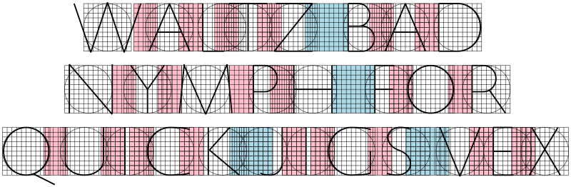

# trajans

Generate skeletons for text set in Trajan capitals

## Rendering text

To render text, use

```
cabal run trajans -- \
  -o fox.svg \
  -w 800 \
  --render \
  --text $'The quick\nbrown fox\njumps over\nthe lazy dog' \
  --right
```

This gets you something like


(`--left` and `--center` alignment are also supported).

Optionally a grid can be shown underneath every character and spacer, although
the result is probably not useful for most use cases:

```
cabal run trajans -- \
  -o waltz.svg \
  -w 800 \
  --render \
  --text $'Waltz bad\nnymph for\nquick jigs vex' \
  --center \
  --grid
```



## Alphabet

Running

```
cabal run trajans -- -o alphabet.svg -h 1200 --alphabet
```

shows the full alphabet along with spacing information:

