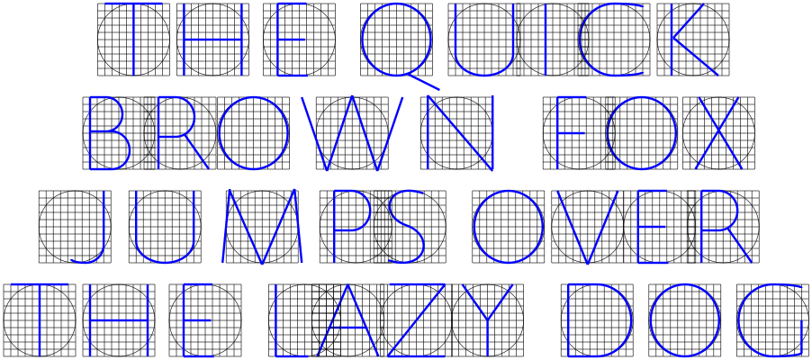
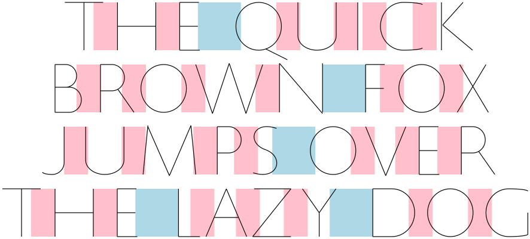
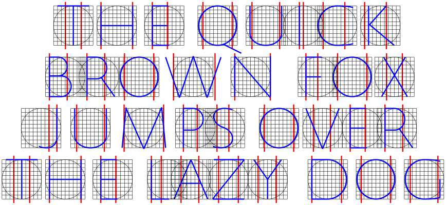
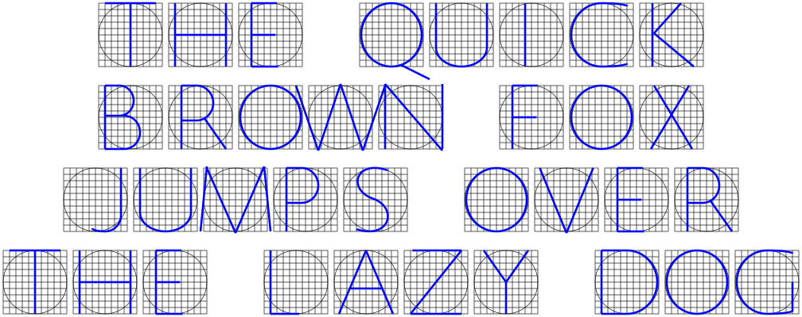
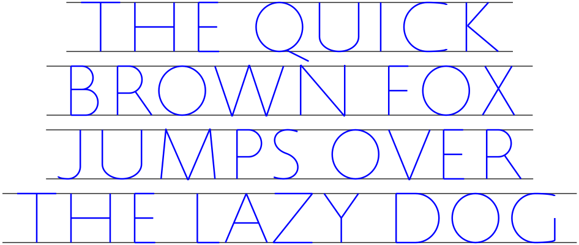

# Trajans

Generate skeletons for text set in Trajan capitals

## Formal Trajans

```
cabal run trajans -- \
  -o examples/default.png \
  -h 400 \
  --text $'The quick\nbrown fox\njumps over\nthe lazy dog'
```

This gets you something like


### Justification

Instead of centering, we can left align

```
cabal run trajans -- --left \
  -o examples/left.png \
  -h 400 \
  --text $'The quick\nbrown fox\njumps over\nthe lazy dog'
```


or right align

```
cabal run trajans -- --right \
  -o examples/right.png \
  -h 400 \
  --text $'The quick\nbrown fox\njumps over\nthe lazy dog'
```


### Rendering options

You can ask for a grid to be displayed underneath each character, set line
thickness, or change colour:

```
cabal run trajans -- --grid \
  --thickness medium --colour blue \
  -o examples/grid.png \
  -h 400 \
  --text $'The quick\nbrown fox\njumps over\nthe lazy dog'
```



Letter spacing can be highlighted:

```
cabal run trajans -- --spacing highlight \
  -o examples/spacing.png \
  -h 400 \
  --text $'The quick\nbrown fox\njumps over\nthe lazy dog'
```



Also to help with letter spacing, the "optical width" of each character can
be shown:

```
cabal run trajans -- --bounds \
  --grid --thickness medium --colour blue \
  -o examples/bounds.png \
  -h 400 \
  --text $'The quick\nbrown fox\njumps over\nthe lazy dog'
```



We can also disable proper letting spacing altogether:

```
cabal run trajans -- --spacing regular \
  --grid --thickness medium --colour blue \
  -o examples/regular.png \
  -h 400 \
  --text $'The quick\nbrown fox\njumps over\nthe lazy dog'
```



We can ask for rulers (guidelines) above and below the line:

```
cabal run trajans -- --rulers --colour blue --thickness medium \
  -o examples/rulers.png \
  -h 400 \
  --text $'The quick\nbrown fox\njumps over\nthe lazy dog'
```



## Informal trajans

We can reduce the formality of these trajans in a number of steps.
First, we can compress along the X-axis:

```
cabal run trajans -- --xcompr \
  -o examples/compressed.png \
  -h 400 \
  --text $'The quick\nbrown fox\njumps over\nthe lazy dog'
```


Then, we can set a slope (in degrees):

```
cabal run trajans -- --slope 5 \
  --xcompr \
  -o examples/sloped.png \
  -h 400 \
  --text $'The quick\nbrown fox\njumps over\nthe lazy dog'
```


